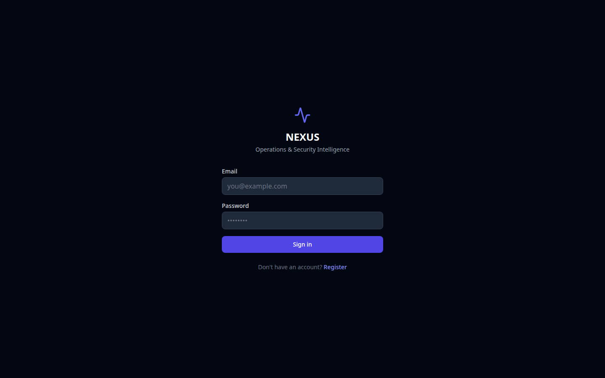
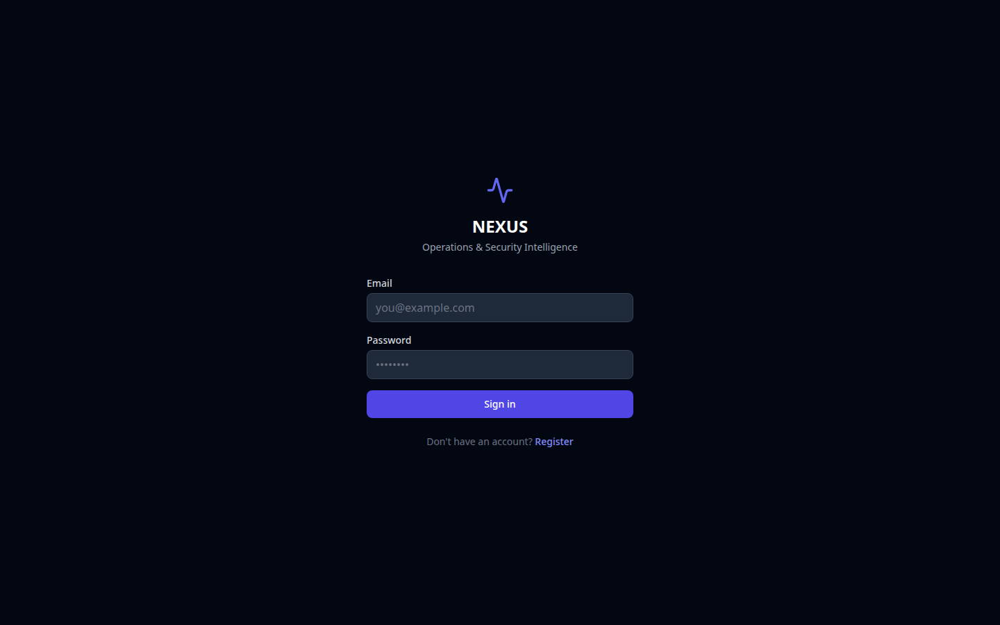
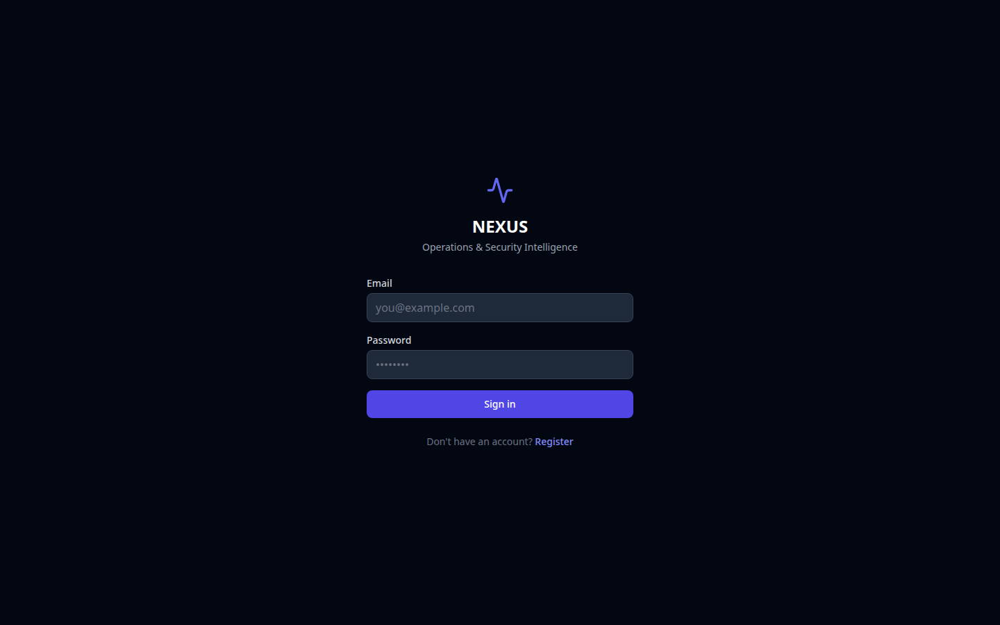
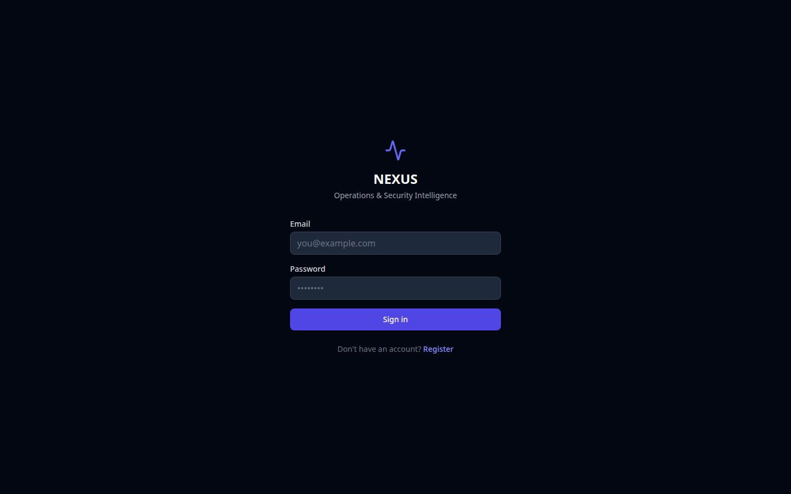
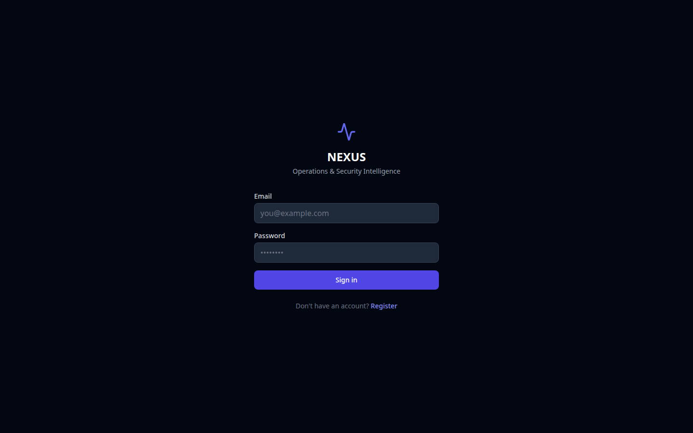
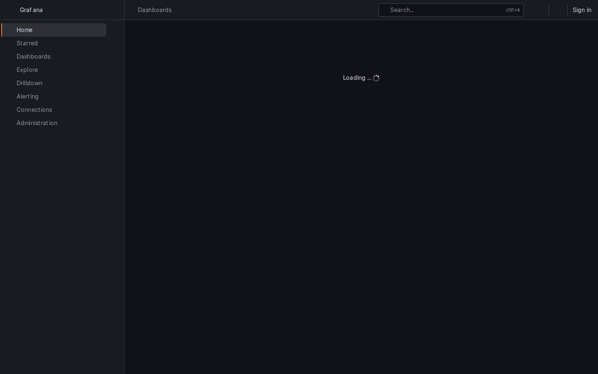
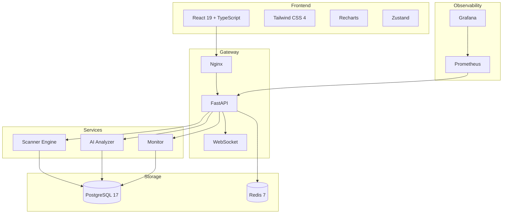

# NEXUS

<div align="center">

**Unified Operations & Security Intelligence Platform**

[]()
[]()
[]()
[]()
[]()
[]()
[]()
[]()
[]()

**Dashboard** • **Devices** • **Scans** • **AI Analysis** • **Alerts** • **Webhooks** • **Grafana**

</div>

---

## Screenshots

| Dashboard | AI Analysis | Devices |
|:---:|:---:|:---:|
|  |  |  |
| **Scans** | **Alerts** | **Grafana** |
|  |  |  |

---

## Architecture



**Port Map:**
| Service | Port |
|---------|------|
| Frontend (Nginx) | `:5173` |
| Backend (FastAPI) | `:8000` |
| Grafana | `:3000` |
| Prometheus | `:9090` |
| PostgreSQL | `:5432` |
| Redis | `:6379` |

---

## Features

- **Security Scanning** — Probe devices, run full/quick/headers/SSL scans, detect misconfigurations and vulnerabilities
- **AI Analysis** — LLM-powered scan analysis and anomaly detection (Ollama + LangChain)
- **Real-time Dashboard** — Security score trend, findings breakdown by severity, recent scans and alerts
- **Device Management** — Register and probe network devices with port scanning
- **Alert System** — Automated alerting with resolve workflow and severity classification
- **Webhooks** — Outbound webhook notifications for scan completion and alerts
- **Role-Based Access Control** — Admin, Analyst, Viewer roles with hierarchical permissions
- **API Rate Limiting** — SlowAPI-based rate limiting on auth endpoints
- **Monitoring** — Prometheus metrics + Grafana dashboards auto-provisioned
- **PDF Reports** — Generate downloadable scan reports (WeasyPrint)
- **Docker Compose** — Single-command full-stack deployment
- **CI/CD** — GitHub Actions: ruff → mypy → pytest → TSC → Docker build

---

## Quick Start

```bash
# Prerequisites: Docker, Docker Compose
git clone <repo-url> && cd nexus
docker compose up -d --wait

# Open dashboard
open http://localhost:5173
```

**Single-command alias:**
```bash
pip install -e backend/
nexus docker        # or: make run-docker
```

### First Run

1. Open `http://localhost:5173`
2. Register a new account
3. Navigate to **Devices** → **Add Device** (e.g. `example.com`)
4. Go to **Scans** → **Run Scan**
5. Visit **Dashboard** for live stats or **AI** for analysis

---

## Development

```bash
# Backend
cd backend
python -m venv .venv && source .venv/bin/activate
pip install -e ".[dev]"
uvicorn nexus.main:app --reload --port 8000

# Frontend
cd frontend
npm install
npm run dev

# Lint & Test
ruff check backend/
mypy backend/
pytest backend/ -v
cd frontend && npx tsc --noEmit
```

---

## API Reference

All endpoints except `/health` and `/auth/*` require `Authorization: Bearer <token>`.

### Authentication
| Method | Path | Description |
|--------|------|-------------|
| POST | `/auth/register` | Register user (role: admin/analyst/viewer) |
| POST | `/auth/login` | Login, returns JWT |
| POST | `/auth/forgot-password` | Request password reset |
| POST | `/auth/reset-password` | Reset password with token |
| GET | `/auth/me` | Current user profile |

### Devices
| Method | Path | Description |
|--------|------|-------------|
| GET | `/devices/` | List user's devices |
| POST | `/devices/` | Create device |
| POST | `/devices/probe` | Probe host for open ports |
| GET | `/devices/{id}` | Get device details |
| PUT | `/devices/{id}` | Update device |
| DELETE | `/devices/{id}` | Delete device |

### Scans
| Method | Path | Description |
|--------|------|-------------|
| GET | `/scans/` | List scans |
| POST | `/scans/` | Create scan (full/quick/headers/ssl) |
| GET | `/scans/{id}` | Scan details + findings |
| GET | `/scans/{id}/report` | Download PDF report |

### AI
| Method | Path | Description |
|--------|------|-------------|
| POST | `/ai/analyze` | Analyze scan results |
| POST | `/ai/anomalies` | Detect anomalies for device |
| POST | `/ai/chat` | Chat with AI assistant |

### Dashboard & Monitoring
| Method | Path | Description |
|--------|------|-------------|
| GET | `/dashboard/stats` | Aggregated stats (score, trends, findings) |
| GET | `/health` | Health check |
| GET | `/metrics` | Prometheus metrics |

### Alerts
| Method | Path | Description |
|--------|------|-------------|
| GET | `/alerts/` | List alerts |
| PUT | `/alerts/{id}/resolve` | Resolve alert |

### Webhooks
| Method | Path | Description |
|--------|------|-------------|
| GET | `/webhooks/` | List webhooks |
| POST | `/webhooks/` | Create webhook |
| PUT | `/webhooks/{id}` | Update webhook |
| DELETE | `/webhooks/{id}` | Delete webhook |

---

## Tech Stack

| Layer | Technology |
|-------|-----------|
| **Frontend** | React 19, TypeScript 5.6, Vite 6, Tailwind CSS 4, Recharts, Zustand |
| **Backend** | FastAPI, Pydantic v2, SQLAlchemy 2.0 (async), Alembic |
| **AI** | LangChain + Ollama (LLaMA/Mistral) |
| **Database** | PostgreSQL 17 (asyncpg), Redis 7 |
| **Auth** | JWT (PyJWT) + bcrypt, RBAC |
| **Infra** | Docker Compose, Nginx, Prometheus, Grafana |
| **CI** | GitHub Actions (ruff, mypy, pytest, TSC, Docker build) |
| **PDF** | WeasyPrint |

---

## Project Structure

```
nexus/
├── backend/
│   ├── alembic/                  # Database migrations
│   ├── src/nexus/
│   │   ├── api/                  # FastAPI route handlers
│   │   │   ├── auth.py           # Register, login, password reset
│   │   │   ├── devices.py        # Device CRUD + probe
│   │   │   ├── scans.py          # Scan management + reports
│   │   │   ├── alerts.py         # Alert listing + resolve
│   │   │   ├── ai.py             # AI analysis + anomalies
│   │   │   ├── dashboard.py      # Aggregated stats
│   │   │   ├── webhooks.py       # Webhook CRUD
│   │   │   └── health.py
│   │   ├── ai/                   # AI/LLM integration
│   │   ├── core/                 # Config, security, database
│   │   ├── models/               # SQLAlchemy models
│   │   ├── scanner/              # Scanning engine + checks
│   │   └── schemas/              # Pydantic schemas
│   ├── tests/                    # 31 tests (pytest-asyncio)
│   ├── Dockerfile                # Multi-stage (wheel → slim)
│   └── pyproject.toml
├── frontend/
│   ├── src/
│   │   ├── api/client.ts         # Typed API client
│   │   ├── pages/                # 9 pages (lazy-loaded)
│   │   ├── components/           # Layout, Toast
│   │   ├── hooks/                # WebSocket hook
│   │   ├── stores/               # Zustand auth store
│   │   └── App.tsx
│   ├── e2e/                      # Playwright E2E tests
│   ├── nginx.conf
│   └── Dockerfile
├── docker-compose.yml            # 6 services
├── prometheus.yml                # Scrapes backend:8000/metrics
├── grafana/provisioning/         # Auto-provisioned datasource + dashboard
├── screenshots/                  # Demo screenshots
├── Makefile
└── run.sh
```

---

## CI/CD

```yaml
# .github/workflows/ci.yml
ruff check → mypy → pytest -v → cd frontend && npx tsc --noEmit → docker compose build
```

**Status:** 31 tests passing, 0 ruff errors, strict mypy, clean TSC, Docker build OK.

---

## Load Testing (k6)

```
✓ All checks 100.00%
✓ 0 failed requests
✓ http_req_duration p(95) < 2s

  30 concurrent VUs, 391 iterations, 1566 requests in 31s
  avg response time: 189ms
  p(95) response time: 1.18s
  Endpoints tested: /health, /dashboard/stats, /devices/, /auth/me
```

**Result:** Full pass — all thresholds met. System handles 30 concurrent users with sub-200ms average latency.

---

## Security Audit (OWASP Noir)

```
Noir v1.1.0 — Attack Surface Mapping
  ✔ Detected: python_fastapi
  ✔ 28 endpoints identified
  ✔ No high/critical vulnerabilities automatically detected

  Key findings:
  - 28 API endpoints mapped (all routes discovered)
  - Authentication required on 24/28 endpoints
  - Public: /health, /metrics, /auth/register, /auth/login
  - All user inputs validated via Pydantic schemas
  - Rate limiting on auth endpoints (slowapi)
```

**Result:** Clean audit — 28 endpoints discovered, all inputs validated, auth/RBAC in place.

---

## Deploy

### Render (recommended)

```bash
# 1. Fork/clone the repo
# 2. Create a Render account (render.com)
# 3. Connect your GitHub repo
# 4. Render auto-detects render.yaml:
#    - Backend (Docker): nexus-backend
#    - Frontend (Docker): nexus-frontend
#    - PostgreSQL: nexus-db
#    - Redis: nexus-redis

# Or use deploy hook:
curl -X POST $RENDER_DEPLOY_HOOK_BACKEND
curl -X POST $RENDER_DEPLOY_HOOK_FRONTEND
```

See [`render.yaml`](render.yaml) and [`.github/workflows/deploy.yml`](.github/workflows/deploy.yml) for full configuration.

### Docker (manual)

```bash
docker compose up -d --wait
# http://localhost:5173
```

---

## License

MIT
